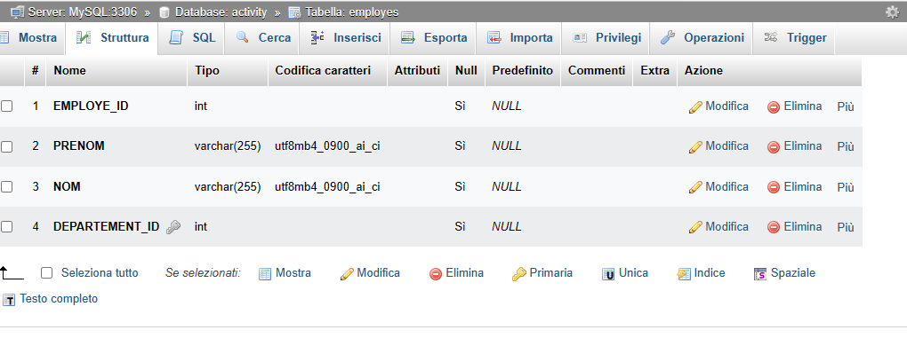
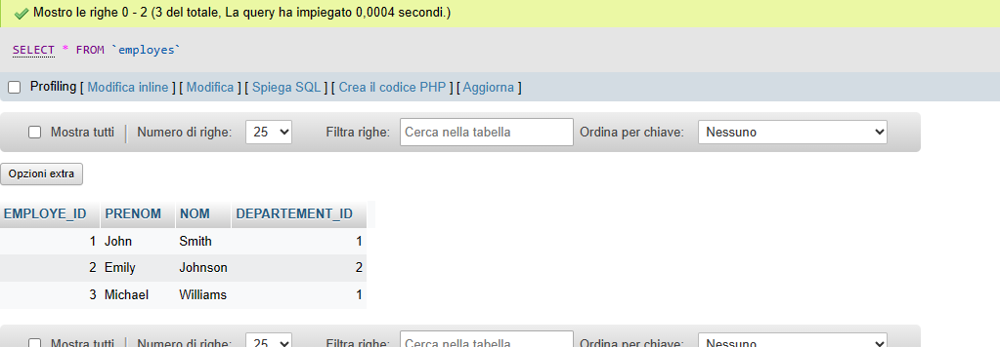
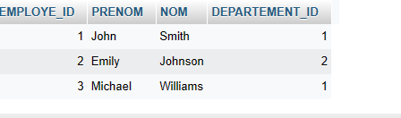

# Activite-pratique-sql
<h2>CREATION DE LA BASE DE DONNEES</h2>

<h3>Tables Employe</h3>

<h3>Tables Employe</h3>

<h3> Employe Data</h3>

<h3> Departement Data</h3>

<h2>Ecrire des requêtes SQL pour accomplir les tâches suivantes</h2>
<h4>Sélectionnez toutes les données des employés. </h4>
 <pre> SELECT   * FROM employes; </pres>

 <pre> SELECT employes.NOM,departements.NOM FROM `employes` JOIN departements;</pres>

